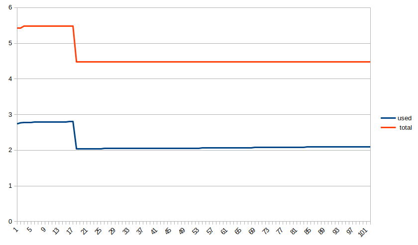

# Raw if, Array.includes(v), Static Array.includes(v)

## Raw if

This is the base line, this funtion just allocate the strings
and make the comparison...

```js
function rawIf() {
  const word = 'ok';
  if (word === 'aa' || word === 'bb' || word === 'cc' || word === 'dd' || word === 'ok');
}
```





## Array.includes(value)

Each call will allocate all the strings, an array with 5 slots,
assign each string to its respective slots, and then, make the tests...

```js
function arrayInclude() {
  const word = 'ok';
  if (['aa', 'bb', 'cc', 'dd', 'ok'].includes(word));
}
```


## Static Array.includes(value)

In this case, we create the array outside of the function to not pay
the cost of creating each time we call the function.

This will increase the initial memory required, so
need to be careful if we are dealing with IOT and small stuff...

This will have more impact on performance, not memory.

```js
const aio = ['a', 'b', 'c', 'd', 'ok'];

function arrayIncludeOptimized() {
  const word = 'ok';
  if (aio.includes(word));
}
```


