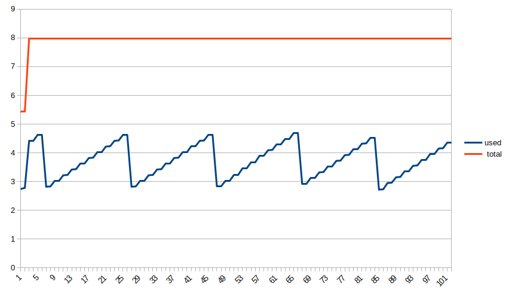

# Object conditional destructuring

## Single object conditional destructuring assignment

```js
function destructuring() {
  ({ a: 1, ...(true && { b: 2 }) });
}
```


## Static object conditional destructuring assignment

```js
const objectInject = { b: 2 };

function destructuringOptimized() {
  ({ a: 1, ...(true && objectInject) });
}
```




## Simple conditional object assignment

```js
function assign() {
  let o = { a: 1 };
  true && (o['b'] = 2);
}
```


